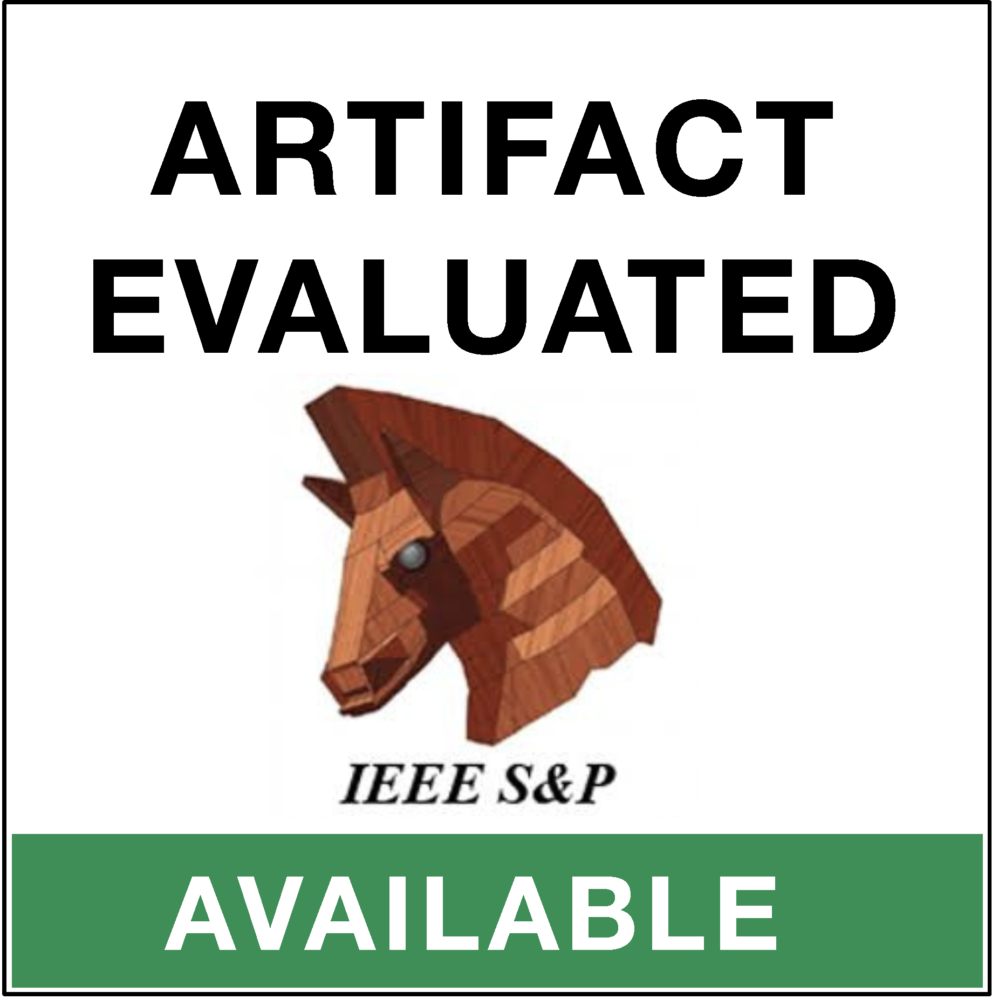
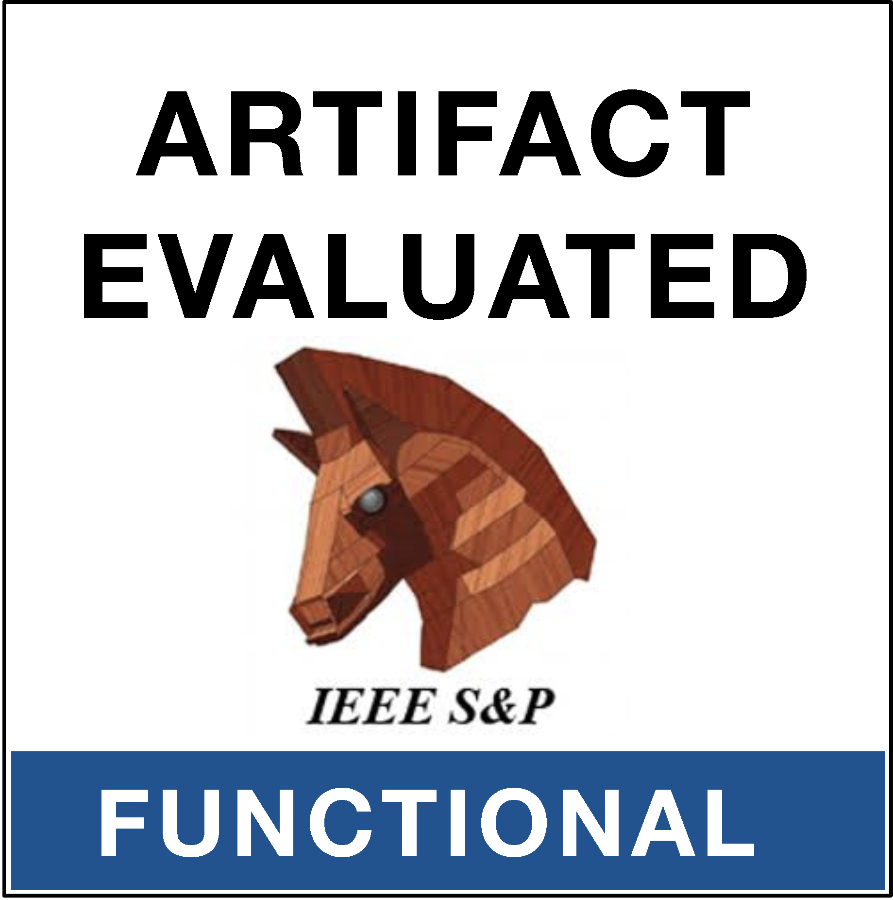
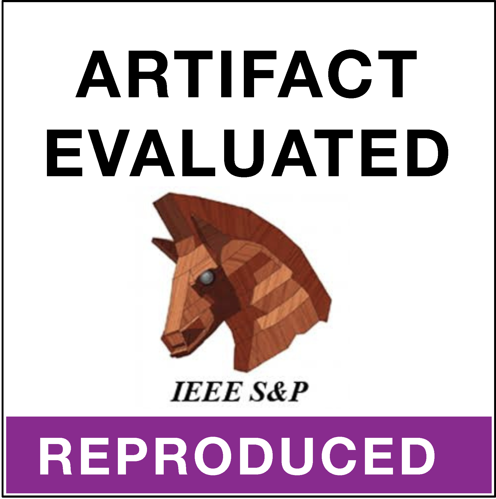

## Secure Speculative Decoding for Large Language Models

<p>
  
  
  
</p>

<!-- TODO: [[ArXiv]](https://arxiv.org/abs/XXXX.XXXXX) -->

This is the official repository for **[IEEE S&P 2027] Secure Speculative Decoding for Large Language Models**. The paper shows that the relaxed verifiers used to speed up speculative decoding also weaken the safety alignment of the target model, and proposes **SecureSD** to restore it. 

- [Quick Start](#quick-start)
- [Tested Environment](#tested-environment)
- [Run a Single Experiment](#run-a-single-experiment)
- [Score Results](#score-results)
- [Run a Sweep](#run-a-sweep)
- [Dataset](#dataset)
- [Citation](#citation)


## Quick Start

We use [uv](https://docs.astral.sh/uv/) to manage the environment. Python is pinned to `>=3.11,<3.13` and dependencies are locked in `uv.lock`.

```sh
curl -LsSf https://astral.sh/uv/install.sh | sh  # Install uv
uv venv --python 3.12 .venv
uv sync --extra scripts                          # Synchronize the environment
uv pip install -e . --no-deps
```

If `flash-attn` fails to build under isolation:

```sh
uv pip install --no-build-isolation flash-attn==2.8.3
```

Everything runs locally and **no API key is needed**, but four of the six model repositories are gated on Hugging Face. Accept each licence on its model page (see [Models](#models)), create a read token at <https://huggingface.co/settings/tokens>, then authenticate:

```sh
.venv/bin/huggingface-cli login     # or: export HF_TOKEN=hf_...
```

The following command runs a small end-to-end experiment:

```sh
CUDA_VISIBLE_DEVICES=0 .venv/bin/python bench/bench.py \
  --method lossy_sd --lossy_epsilon 0.2 \
  --target_model Qwen/Qwen3-8B --draft_model Qwen/Qwen3-0.6B \
  --dataset jailbreaking --jb_file jb_qwen3_200.json \
  --num_seqs 200 --max_num_seqs 32 --output_len 512 \
  --speculate_k 5 --eta_schedule step --eta_start 0 --eta_end 1 --eta_len 1 \
  --experiment_name demo
```

It decodes 200 jailbreak prompts with the LossySD verifier, corrects the first generated token with exact speculative decoding (`--eta_len 1`), scores the completions with WildGuard, and prints acceptance rate, throughput and peak memory. The report is written under `.results/demo/`.

## Tested Environment

Our experiments were validated on the following machine. Exact hardware is not required.

| Component     | Configuration                                                                |
| ------------- | ---------------------------------------------------------------------------- |
| GPU           | 4 × NVIDIA RTX PRO 6000 Blackwell Max-Q Workstation Edition, 97,887 MiB each |
| NVIDIA driver | 595.58.03 (>= 570 with CUDA 12.8 is required)                                |
| CPU           | 2 × AMD EPYC 9334 32-Core Processor                                          |
| Disk          | ~60 GB free (~18 GB model weights, ~20 GB judge weights, reports)            |

One GPU with **at least 40 GB** is enough for an 8B target plus a 0.6-1B draft model. The engine sizes its KV cache from *free* memory, so a smaller card still works at a reduced `--max_num_seqs`. Do not share the GPU with another job: a co-tenant changes the batch composition, and with it both the throughput numbers and the generated tokens.

**Environment Variables**

| Variable               | Description                                                                    |
| ---------------------- | ------------------------------------------------------------------------------ |
| `SSD_CUDA_ARCH`        | FlashInfer's JIT target, e.g. `9.0` for H100, `12.0` for RTX PRO 6000.         |
| `SECURESD_HF_ROOT`     | Reuse an existing Hugging Face hub cache.                                      |
| `SECURESD_RESULTS_DIR` | Write reports somewhere other than `.results/`.                                |

### Models

| Model                                    | Role                      | Gated   |
| ---------------------------------------- | ------------------------- | ------- |
| `Qwen/Qwen3-8B`, `Qwen/Qwen3-0.6B`       | target / draft, Qwen pair | no      |
| `meta-llama/Llama-3.1-8B-Instruct`       | target, Llama pair        | **yes** |
| `meta-llama/Llama-3.2-1B-Instruct`       | draft, Llama pair         | **yes** |
| `allenai/wildguard`                      | jailbreak judge           | **yes** |
| `meta-llama/Llama-3.2-3B-Instruct`       | prompt-injection judge    | **yes** |

HumanEval (`openai/openai_humaneval`) and GSM8K (`openai/gsm8k`) are downloaded on first use and need no token.

## Run a Single Experiment

Use `bench/bench.py` to run one experiment. One invocation = one decoding method on one benchmark = one JSON report.

```sh
CUDA_VISIBLE_DEVICES=0 .venv/bin/python bench/bench.py \
  --method <method> [verifier hyperparameters] \
  --dataset <dataset>
```

To use the Llama pair, pass `--target_model meta-llama/Llama-3.1-8B-Instruct --draft_model meta-llama/Llama-3.2-1B-Instruct`, together with `--jb_file jb_llama_instruct_200.json` or `--pi_file pi_llama_200.json`.

**Decoding Methods**

`--method` selects the verifier; each one has its own hyperparameters.

| `--method`  | Description                                               | Hyperparameters                                              |
| ----------- | --------------------------------------------------------- | ------------------------------------------------------------ |
| `ar_target` | Plain autoregressive decoding with the target model.      | —                                                            |
| `ar_draft`  | Plain autoregressive decoding with the draft model.       | —                                                            |
| `sd`        | Exact (lossless) speculative decoding.                    | —                                                            |
| `lossy_sd`  | Relaxed acceptance with slack epsilon.                    | `--lossy_epsilon`                                            |
| `fsd`       | Accept while the draft/target divergence stays low.       | `--fsd_div_type {js_div,kl_div,tv_div}`, `--fsd_threshold`   |
| `bild`      | Fallback and rollback thresholds on the draft's confidence. | `--bild_fallback_threshold`, `--bild_rollback_threshold`   |
| `mars`      | Accept when the target's probability exceeds theta.       | `--mars_theta`                                               |
| `sc`        | Selective-classification acceptance rule.                 | `--sc_rule {chow,diff,opt}`, `--sc_alpha`                    |
| `fly`       | Entropy-windowed acceptance.                              | `--fly_entropy_threshold`, `--fly_window_size`               |

**SecureSD Options**

`eta(t)` is the probability of applying the relaxed rule at generated-token position `t`; `eta = 0` falls back to exact speculative decoding. The correction is therefore a window of low `eta` at the start of each response.

| Option           | Default | Description                                  |
| ---------------- | ------- | -------------------------------------------- |
| `--eta_schedule` | `step`  | One of `step`, `linear`, or `power`.         |
| `--eta_start`    | `0.0`   | eta at position 0.                           |
| `--eta_end`      | `1.0`   | eta after the window.                        |
| `--eta_len`      | `2.0`   | Window length L in generated tokens.         |
| `--eta_gamma`    | `1.0`   | Exponent, `power` schedule only.             |

With the default `step` schedule, `--eta_len 0` disables the correction (the relaxed verifier runs everywhere) and `--eta_len L` corrects the first `L` generated tokens.

**Common Options**

| Option                             | Default                             | Description                                                        |
| ---------------------------------- | ----------------------------------- | ------------------------------------------------------------------ |
| `--method`                         | required                            | See [Decoding Methods](#run-a-single-experiment).                  |
| `--dataset`                        | `humaneval`                         | One of `humaneval`, `gsm8k`, `jailbreaking`, or `prompt_injection`. |
| `--target_model` / `--draft_model` | `Qwen/Qwen3-8B` / `Qwen/Qwen3-0.6B` | Hugging Face repo ids.                                             |
| `--speculate_k`                    | `5`                                 | Speculative length (draft tokens per step).                        |
| `--num_seqs`                       | `200`                               | Number of prompts to run.                                          |
| `--max_num_seqs`                   | `1`                                 | Batch size.                                                        |
| `--output_len`                     | `8192`                              | Maximum number of new tokens per prompt.                           |
| `--temp` / `--dtemp`               | `0.0`                               | Target / draft sampling temperature.                               |
| `--jb_file`                        | `jb_qwen3_200.json`                 | Jailbreak prompt set; used with `--dataset jailbreaking`.          |
| `--pi_file`                        | —                                   | Prompt-injection set; required for `--dataset prompt_injection`.   |
| `--experiment_name`                | `default_experiment`                | Subdirectory of `.results/`.                                       |
| `--no_utility_eval`                | off                                 | Generate only; score later with `bench/judge.py`.                  |
| `--results_root`                   | `.results`                          | Where reports are written.                                         |

**Output**

Each run writes to:

```text
.results/<experiment_name>/<method>/<method>_b<batch>_<hparams>_eta<schedule>_....json
.results/<experiment_name>/<method>/raw_<same name>.json
```

The report holds the run's configuration, efficiency metrics (acceptance rate, tokens/s, speedup over `ar_target`, peak memory) and, once scored, the utility or attack-success numbers. The `raw_` file keeps the prompts and the generated text, so a run can be re-scored without re-generating.

## Score Results

Judging loads WildGuard or the prompt-injection judge, so it is usually cheaper to generate with `--no_utility_eval` and score a whole result tree afterwards with `bench/judge.py`:

```sh
CUDA_VISIBLE_DEVICES=0 .venv/bin/python bench/judge.py .results/demo
```

`bench/judge.py` walks the tree, scores every report that has no utility block yet, and writes the results back in place.

| Option      | Description                                   |
| ----------- | --------------------------------------------- |
| `--force`   | Re-score reports that are already scored.     |
| `--limit N` | Score only N reports, for a smoke run.        |
| `--shard I/N` | Split one tree across N GPUs; this is shard I. |

To score several result trees over a pool of GPUs:

```sh
printf '%s\n' .results/eta_qwen_* > queue.txt
bash scripts/judge_pool.sh --queue queue.txt --gpus 0,1,2,3
```

## Run a Sweep

A sweep config is a JSON file describing the settings shared by every job, the methods to run, the correction schedules, and a hyperparameter grid per method. `scripts/qwen/` and `scripts/llama/` hold one config per benchmark, which are the configs used in the paper.

```json
{
  "common":      { "target_model": "Qwen/Qwen3-8B", "draft_model": "Qwen/Qwen3-0.6B",
                   "num_seqs": 200, "max_num_seqs": 32, "output_len": 512, "speculate_k": 5 },
  "eta_configs": ["step:0:1:1", "step:0:1:2"],
  "methods":     ["ar_target", "ar_draft", "sd", "lossy_sd", "fsd"],
  "grids":       { "lossy_sd": { "lossy_epsilon": { "min": 0, "max": 1, "num": 21 } },
                   "fsd":      { "fsd_div_type": ["js_div"],
                                 "fsd_threshold": { "values": [0.1, 0.2, 0.4] } } }
}
```

`eta_configs` entries are `schedule:start:end:len[:gamma]`. Grid axes take either `{"values": [...]}` or `{"min": , "max": , "num": }`; several blocks in a list are unioned, so a grid can be dense in one region and sparse elsewhere.

Preview the jobs a config expands to:

```sh
.venv/bin/python scripts/gen_jobs.py scripts/qwen/jailbreaking.json | wc -l
```

Run them across a pool of GPUs:

```sh
CUDA_VISIBLE_DEVICES=0,1,2,3 \
SWEEP_EXPERIMENT=eta_qwen_jailbreaking \
SWEEP_DATASET=jailbreaking \
SWEEP_EXTRA="--no_utility_eval" \
  bash scripts/sweep.sh scripts/qwen/jailbreaking.json
```

One job runs per GPU at a time; when a job finishes, the next one starts on that card. **Re-running is safe and resumes**: a job whose report already exists is skipped, so an interrupted sweep continues where it stopped.

**Sweep Options**

| Variable                   | Default              | Description                                          |
| -------------------------- | -------------------- | ---------------------------------------------------- |
| `CUDA_VISIBLE_DEVICES`     | required             | GPU ids to use as job slots.                         |
| `SWEEP_EXPERIMENT`         | `default_experiment` | `.results/` subdirectory for this sweep.             |
| `SWEEP_DATASET`            | `humaneval`          | Benchmark to run the config against.                 |
| `SWEEP_EXTRA`              | —                    | Extra flags appended to every job.                   |
| `SWEEP_SUBSAMPLE`          | `1`                  | Keep every N-th grid point, to thin a sweep.         |
| `SKIP_DONE`                | `1`                  | Set to `0` to re-run finished jobs.                  |
| `DRY_RUN`                  | `0`                  | Set to `1` to list the jobs without running them.    |
| `MAX_CONSECUTIVE_FAILURES` | `5`                  | Abort once this many jobs fail in a row.             |

Then score the tree as described in [Score Results](#score-results).

A full grid is large: the configs in `scripts/` are the paper-scale sweeps and cost GPU-days. Thin them with `SWEEP_SUBSAMPLE`, a shorter `eta_configs` list, or a smaller `num_seqs` before committing a cluster to one.

## Dataset

The two security prompt sets ship under `.data/`, 200 samples each, one file per model pair:

```text
.data/jailbreaking/jb_qwen3_200.json           # Jailbreak prompts, Qwen pair
.data/jailbreaking/jb_llama_instruct_200.json  # Jailbreak prompts, Llama pair
.data/promptinjection/pi_qwen_200.json         # Prompt-injection prompts, Qwen pair
.data/promptinjection/pi_llama_200.json        # Prompt-injection prompts, Llama pair
```

Select one with `--jb_file` or `--pi_file`, which take a file name relative to the directory above or an absolute path. HumanEval and GSM8K are loaded from Hugging Face.

## Citation

```bibtex
@inproceedings{zhang2027secure,
  author={Yichi Zhang and Zhiqi Wang and Neil Gong and Yuchen Yang},
  title={Secure Speculative Decoding for Large Language Models},
  booktitle={2027 IEEE Symposium on Security and Privacy (SP)},
  year={2027},
}
```
